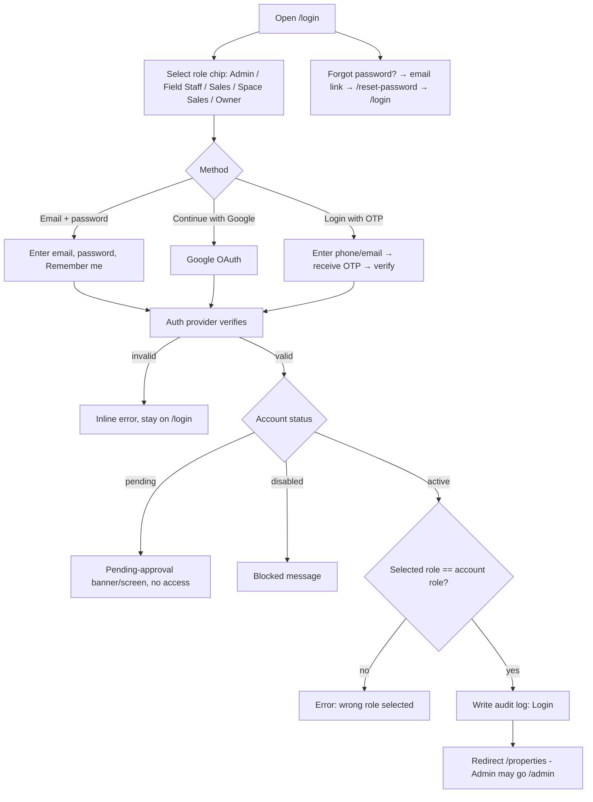
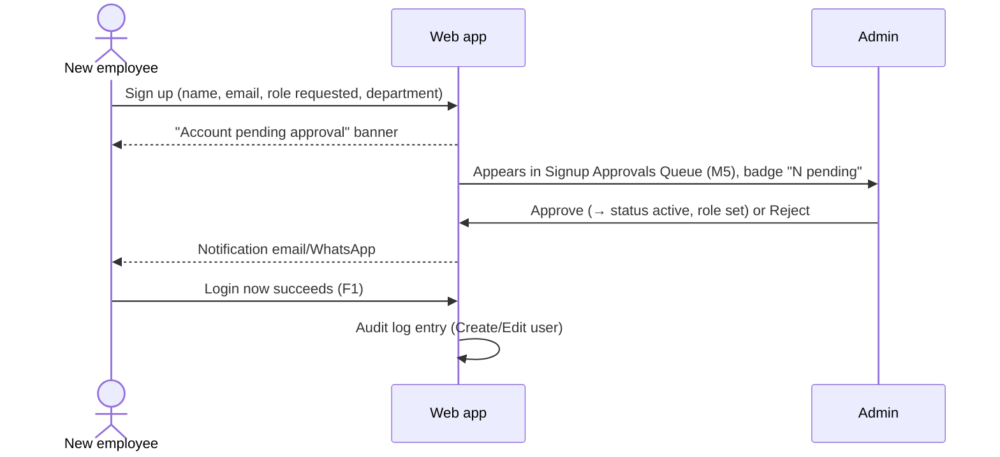
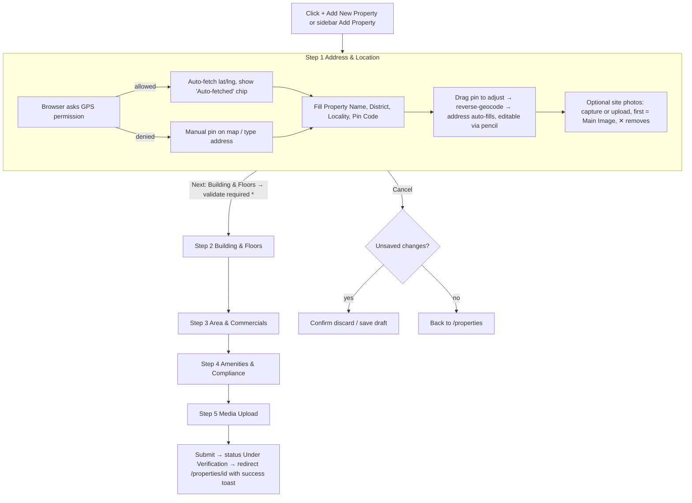
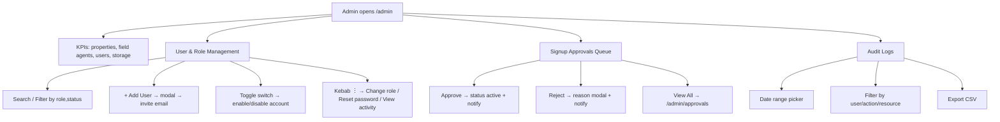

# PropSync — User Flows

All diagrams are Mermaid (render in GitHub/Cursor preview). Screens refer to mockups: **M1** Login, **M2** Properties list, **M3** Add Property S1, **M4** Property detail, **M5** Admin.

## F1. Authentication (M1)


Notes: role chip is a UX filter; the **real role comes from the token** and is enforced by the API. Default chip = Admin. Show password toggle on eye icon.

## F2. Employee signup & approval (M1 → M5)



## F3. Browse, search, filter properties (M2)

```mermaid
flowchart TD
  A[/properties/] --> B[See greeting + 4 KPI cards + first 5 cards]
  B --> C[Type in search: locality / district / project]
  B --> D[Filter: Land Use / Availability / Rent range]
  B --> E[Sort: Newest First ...]
  B --> M[Toggle Map View → pins with clustering → click pin → mini card → View Details]
  C --> R[Debounced 300ms request, list + count update, URL query updated]
  D --> R
  E --> R
  R --> P[Pagination 1..n, "Showing 1-5 of N"]
  B --> I[Card image arrows ‹ › cycle photos 1/5]
  B --> K[Bookmark icon → save/unsave]
  B --> Q[Kebab ⋮ → Duplicate / Archive / Delete admin only]
  B --> V[View Details → F5]
  B --> ED[Edit → F4 pre-filled]
  B --> SP[Share PPT → generate deck → download/copy link/WhatsApp]
  B --> N[+ Add New Property → F4]
```

## F4. Add property — 5-step stepper (M3)


Rules: draft auto-saved per step (server draft; IndexedDB offline draft in Phase 2). Completed steps clickable in stepper; future steps locked until previous valid. Area unit toggle converts display only (stored in sq ft). "Use Current Location" re-requests GPS and overwrites pin. Footer banner: location verified during review.

## F5. View & manage a property (M4)

```mermaid
flowchart TD
  A[View Details] --> B[/properties/id Overview tab]
  B --> T[Tabs: Overview · Floor & Amenities · Compliance & Documents · Media & Gallery · Activity & Follow-up]
  B --> X[Export PPT → python-pptx → download]
  B --> SF[Schedule Follow-up → modal: date, channel, note → saved → n8n → WhatsApp reminder]
  B --> E[Edit → /properties/id/edit]
  B --> D[Delete → confirm modal → soft delete → back to list, audit log]
  B --> C[Contact card: phone icon → tel: · WhatsApp icon → wa.me link]
  B --> MAP[Open in Maps / View on Google Maps → new tab]
  B --> GL[Gallery: arrows 1/8, thumbnails, video 0:45 plays in lightbox]
  B --> BK[← Back to Properties keeps previous filters/page]
```
Every open of this page writes audit log **View** (visible in M5).

## F6. Admin operations (M5)


Non-admin hitting `/admin` → 403 page.

## F7. Owner flow
Owner logs in → lands on read-only `/properties` filtered to `owner_id = me` → opens detail (no Edit/Delete/Contacts/Export) → can view compliance status and follow-up activity for own listings.

## F8. Field-staff on-site flow (PWA)
Open installed PWA on phone → Login → **Add Property** → allow GPS → capture photos with camera → fill step 1 → save draft (works offline in Phase 2) → continue steps → submit. Large videos upload via signed URL directly to storage.

## F9. Global behaviours
- Session expiry → `/login?next=<path>`.
- Notification bell: follow-up due, approval decisions, new assigned property.
- Global search (top bar) → results grouped Properties / Users (admin) / Audit (admin).
- Every create/edit/delete/export/login is audit-logged with user, role, IP, resource, details.
